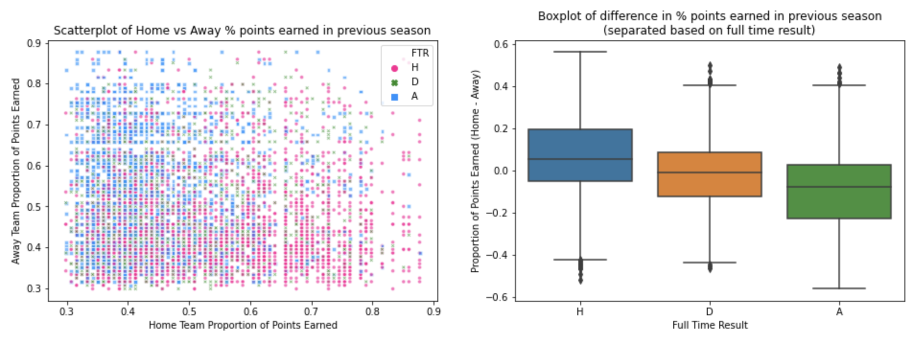
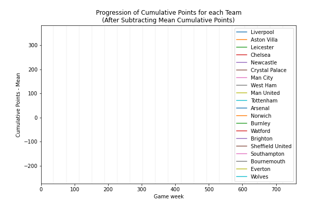
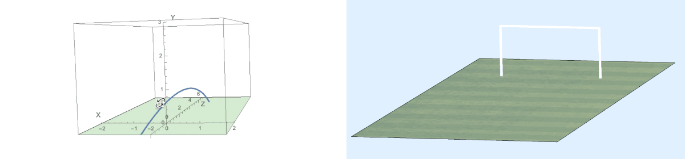

# My Portfolio
-------------
-------------

## Monte Carlo Simulation of the English Premier League (Python)

This project explores the use of various Machine Learning algorithms in developing a model capable of simulating fixtures from the English Premier League over multiple seasons while achieving realistic results. The simulation of various betting models is also carried out, with the aim of evaluating the effect of different factors on overall profitability.

The project code is written in Python, within a Jupyer Notebook. To take a quick look at the project, you can click on the following [HTML link](https://htmlpreview.github.io/?https://github.com/fanahanmc/epl-monte-carlo-sim/blob/master/HTML_files/ACM40960_Project_20203868.html). Alternatively, you can navigate to the project's [GitHub repository](https://github.com/fanahanmc/epl-monte-carlo-sim) if you would like to run the code yourself.

-------------

## Movie Review Classification using Statistical Machine Learnning (R)

Add project description...

The code (written in R) and project report were written within an Rmarkdown file. You can view the output PDF generated from the project at the [following link](https://fanahanmc.github.io/PDF_files/STAT30270_FinalAssignment.pdf). If you would like to run the code yourself, you can access the .rmd file and data files at the following GitHub repository... 

-------------

## Human Activity Classification using Neural Networks (R)

Add project description...

The code (written in R) and project report were written within an Rmarkdown file. You can view the output PDF generated from the project at the [following link](https://fanahanmc.github.io/PDF_files/STAT40970_EOT_Assignment_FMS.pdf). If you would like to run the code yourself, you can access the .rmd file and data files at the following GitHub repository... 

-------------

## Football Trajectory Modelling and Simulation (Mathematica)

In this project, the trajectory of a football is modelled based on frames from a given video, using both object recognition and image processing techniques. The modelled trajectory is then simulated using a number of different visualisations, and estimates of speed, maximum height reached and total distance travelled are also calculated.

Mathematica was used to develop this project. If you are lucky enough to have access to Mathematica, then you can find the project notebook and all image and video files in the following [GitHub repository](https://github.com/fanahanmc/football-flight-model-sim). Otherwise, you can view a PDF of the project notebook including all output and plots at the [following link](https://fanahanmc.github.io/PDF_files/ACM40730_Project_static.pdf), albeit without the interactive elements.

-------------

## Statistical Analysis of the English Premier League (R)

Add project description...

The code (written in R) and project report were written within an Rmarkdown file. You can view the output PDF generated from the project at the [following link](https://fanahanmc.github.io/PDF_files/STAT40620_Project_FMS.pdf). If you would like to run the code yourself, you can access the .rmd file and data files at the following GitHub repository... 

-------------

## Classification of Rooms/Scenes using Convolutional Neural Networks (R)

Add project description...

The code (written in R) and project report were written within an Rmarkdown file. You can view the output PDF generated from the project at the [following link](https://fanahanmc.github.io/PDF_files/STAT40970_Assignment3.pdf). If you would like to run the code yourself, you can access the .rmd file and data files at the following GitHub repository... 

-------------

