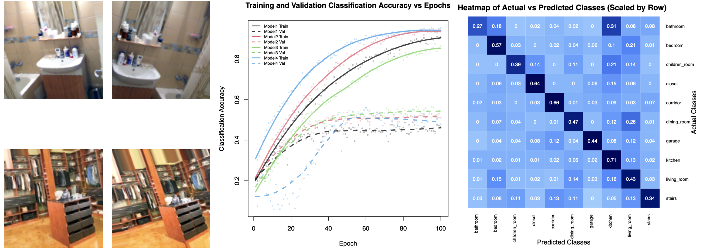

# My Portfolio
-------------

## Monte Carlo Simulation of the English Premier League (Python)

This project explores the use of various Machine Learning algorithms in developing a model capable of simulating fixtures from the English Premier League over multiple seasons while achieving realistic results. The simulation of various betting models is also carried out, with the aim of evaluating the effect of different factors on overall profitability.

The project code is written in Python, within a Jupyer Notebook. To take a quick look at the project, you can click on the following [HTML link](https://htmlpreview.github.io/?https://github.com/fanahanmc/epl-monte-carlo-sim/blob/master/HTML_files/ACM40960_Project_20203868.html). Alternatively, you can navigate to the project's [GitHub repository](https://github.com/fanahanmc/epl-monte-carlo-sim) if you would like to run the code yourself.

-------------

## Movie Review Classification using Statistical Machine Learning (R)

This project looks at classifing movie reviews as either positive or negative based on a number of different features, using different machine learning algorithms such as random forests and support vector machines.

The code (written in R) and project report were written within an Rmarkdown file. You can view the output PDF generated from the project at the [following link](https://fanahanmc.github.io/PDF_files/STAT30270_FinalAssignment.pdf). If you would like to run the code yourself, you can access the .rmd file and data files at the following [GitHub repository](https://github.com/fanahanmc/movie-review-classification).

-------------

## Human Activity Classification using Neural Networks (R)

The aim of this project was to develop a suitable model for classifying activities being performed by a subject, based on sensor data recorded while performing each of the activities. A number of different models were considered, including convolutional and recurrent neural networks.

The code (written in R) and project report were written within an Rmarkdown file. You can view the output PDF generated from the project at the [following link](https://fanahanmc.github.io/PDF_files/STAT40970_EOT_Assignment_FMS.pdf). If you would like to run the code yourself, you can access the .rmd file and data files at the following [GitHub repository](https://github.com/fanahanmc/activity-classification-nnet).

-------------

## Football Trajectory Modelling and Simulation (Mathematica)

In this project, the trajectory of a football is modelled based on frames from a given video, using both object recognition and image processing techniques. The modelled trajectory is then simulated using a number of different visualisations, and estimates of speed, maximum height reached and total distance travelled are also calculated.

Mathematica was used to develop this project. If you are lucky enough to have access to Mathematica, then you can find the project notebook and all image and video files in the following [GitHub repository](https://github.com/fanahanmc/football-flight-model-sim). Otherwise, you can view a PDF of the project notebook including all output and plots at the [following link](https://fanahanmc.github.io/PDF_files/ACM40730_Project_static.pdf), albeit without the interactive elements.

-------------

## Statistical Analysis of the English Premier League (R)

I completed this project during the first term of my master's program. In the first section of the R markdown document I performed a general statistical analysis on the Premier League. I then gave a demonstration of the DataExplorer, an R package which can be used to automate the process of exploratory data analysis. Finally, I developed a package of functions which can be used to perform forward stepwise AIC regression.

The code (written in R) and project report were written within an Rmarkdown file. You can view the output PDF generated from the project at the [following link](https://fanahanmc.github.io/PDF_files/STAT40620_Project_FMS.pdf). If you would like to run the code yourself, you can access the .rmd file and data files at the following [GitHub repository](https://github.com/fanahanmc/epl-stat-analysis).

-------------

## Classification of Rooms/Scenes using Convolutional Neural Networks (R)

In this project, I developed a suitable convolutional neural network capable of performing the difficult task of classifying rooms and indoor scenes based off images.

The code (written in R) and project report were written within an Rmarkdown file. You can view the output PDF generated from the project at the [following link](https://fanahanmc.github.io/PDF_files/STAT40970_Assignment3.pdf). If you would like to run the code yourself, you can access the .rmd file and data files at the following [GitHub repository](https://github.com/fanahanmc/rooms-classification-cnn).

-------------

If you are also interested in seeing my very basic video editing skills, you can click on the image below to view a short video I made as part of an assignment which gives a high level overview of why I chose to do the English Premier League simulation project mentioned earlier.

